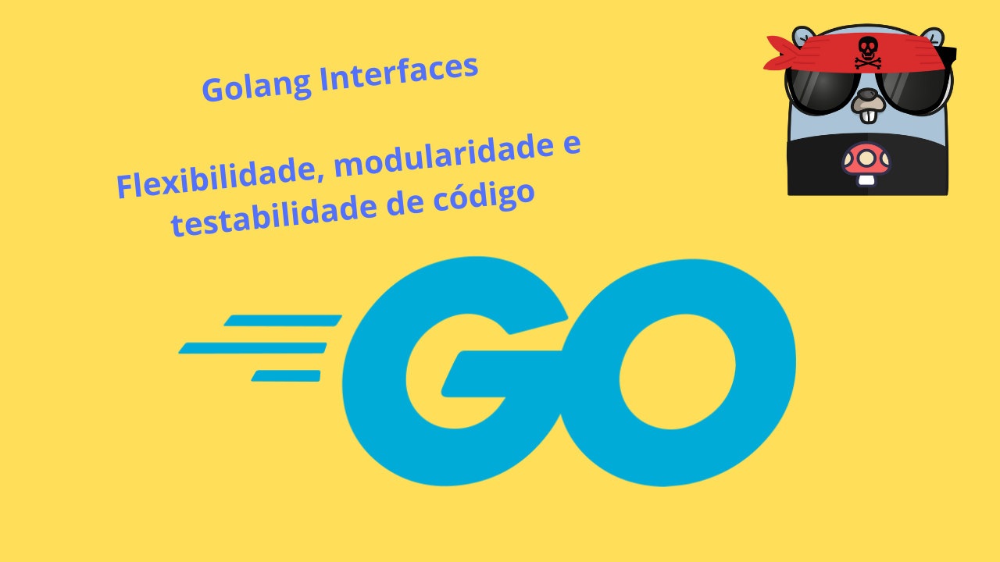

# Golang Interfaces

## Flexibilidade, Modularidade e Testabilidade

Fala galera, neste vídeo tento explicar como usar interfaces em Golang e o que isso pode trazer de benefícios para o nosso projeto.

**Vídeo no YouTube**

